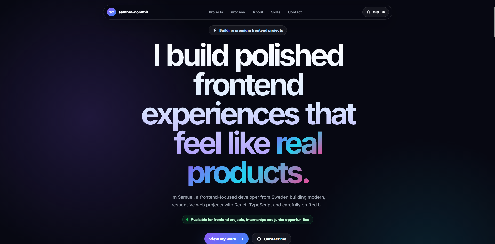
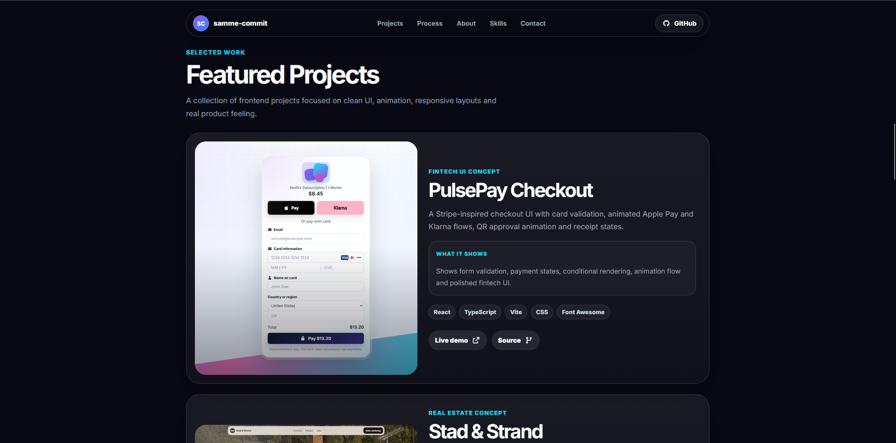
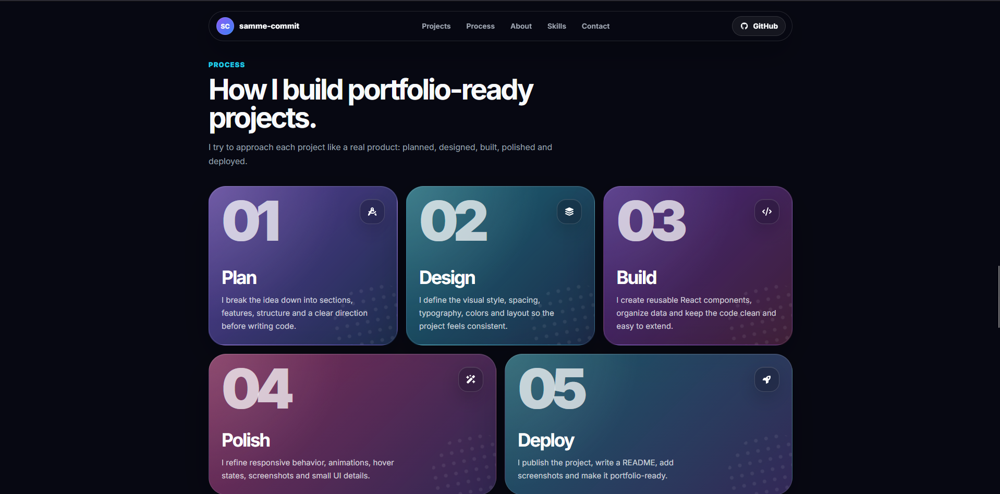
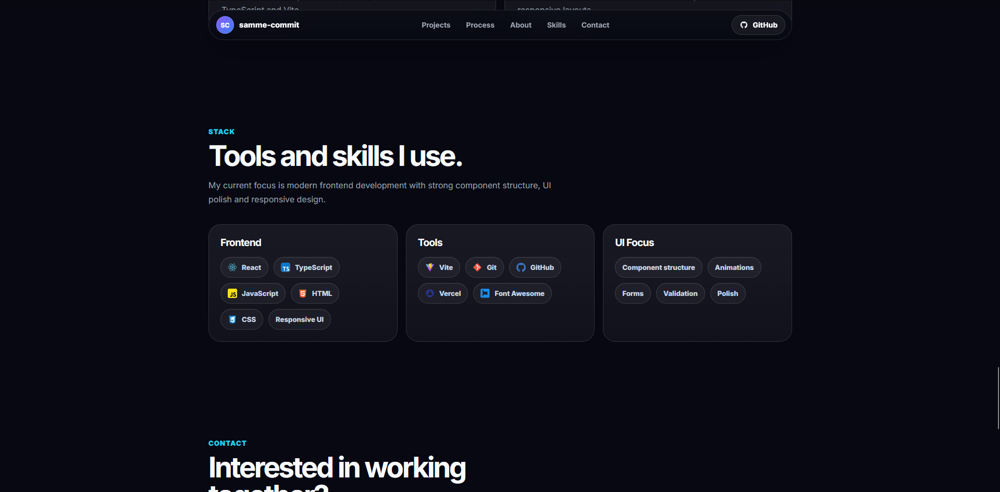
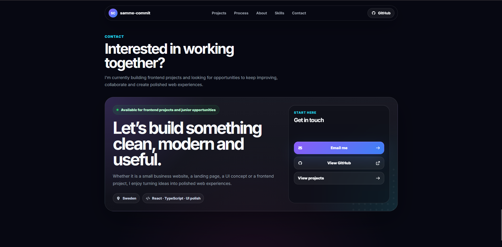

# Samuel Portfolio

Hi, I'm Samuel - a frontend-focused developer from Sweden.

This is my personal portfolio, built to showcase the projects I've been working on while learning and improving my skills in React, TypeScript, UI design and modern frontend development.

The goal with this portfolio was to create something that feels clean, polished and closer to a real product than a basic developer page.



## Live Demo

[View Live Demo](https://portfolio-eight-tawny-21.vercel.app/)

## About the Portfolio

This portfolio is designed around a dark, modern SaaS-inspired style with smooth spacing, project previews, subtle animations and a clear focus on the work itself.

I wanted the site to feel inspired by modern product websites like Linear, Stripe and Tailwind CSS, while still keeping my own style and personality.

## Featured Projects

### PulsePay Checkout

A Stripe-inspired checkout UI concept with card validation, Apple Pay and Klarna demo flows, QR approval animation and a receipt screen.

This project focuses on form handling, payment states, conditional rendering and polished fintech UI.

### Stad & Strand

A premium Swedish real estate website concept inspired by modern property platforms.

This project includes property filtering, large image-based listing cards, agent profiles, modals and a clean luxury-style layout.

### Fears to Fathom Redesign

An unofficial fan-made redesign of the Fears to Fathom website.

This project focuses on atmosphere, dark horror-inspired visuals, episode cards, interactive sections and a more cinematic UI style.

## Screenshots

### Hero


### Featured Projects



### Process



### Tech Stack



### Contact



## Features

* Modern dark portfolio design
* Responsive layout for desktop and mobile
* Animated hero text reveal
* Featured project cards with real screenshots
* "What it shows" sections for each project
* Process section showing how I build projects
* Tech stack section with logos and hover tooltips
* Contact call-to-action section
* Smooth spacing and polished UI details

## Tech Stack

* React
* TypeScript
* Vite
* CSS
* Font Awesome
* GitHub
* Vercel

## Project Structure

```text
src/
├─ components/
│  ├─ About/
│  ├─ Contact/
│  ├─ FeaturedProjects/
│  ├─ Footer/
│  ├─ GradientOrb/
│  ├─ Header/
│  ├─ Hero/
│  ├─ Process/
│  ├─ ProjectCard/
│  ├─ SectionHeader/
│  ├─ Skills/
│  └─ TextReveal/
├─ data/
│  ├─ projects.ts
│  └─ skills.ts
├─ App.css
├─ App.tsx
├─ index.css
└─ main.tsx
```

## Getting Started

Clone the repository:

```bash
git clone https://github.com/samme-commit/portfolio.git
```

Navigate into the project:

```bash
cd portfolio
```

Install dependencies:

```bash
npm install
```

Start the development server:

```bash
npm run dev
```

Build for production:

```bash
npm run build
```

Preview the production build:

```bash
npm run preview
```

## What I Learned

While building this portfolio, I focused on making the site feel like a real frontend project rather than just a simple personal page.

Some of the things I practiced were:

* Structuring a React project with reusable components
* Working with TypeScript types and data files
* Creating responsive layouts
* Improving visual hierarchy and spacing
* Adding subtle animations and hover effects
* Presenting projects in a more professional way
* Making a portfolio that feels personal but still polished

## Author

Built by **Samuel**.

* GitHub: [samme-commit](https://github.com/samme-commit)
